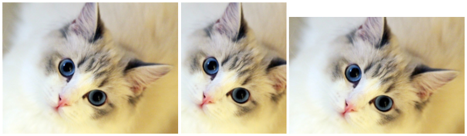

# 居中显示

## img 标签


```html


```

```css
.img2 {
  width: 180px;
  height: 300px;
  object-fit: cover;
}

.img3 {
  width: 300px;
  height: 200px;
  object-fit: cover;
}
```

## background-image 属性



```html
<div class="box1"></div>
<div class="box2"></div>
<div class="box3"></div>
```

```css
div {
  display: inline-block;
  background: url('../images/2.jpg') no-repeat;
}

.box1 {
  width: 300px;
  height: 225px;
  background-size: 100% auto;
}

.box2 {
  width: 180px;
  height: 225px;
  background-position: center;
  background-size: cover;
}

.box3 {
  width: 300px;
  height: 200px;
  background-position: center;
  background-size: cover;
}
```

# 覆盖显示

```css
background-image: url(/images/1.jpg);
background-size: contain;
background-position: center;
background-repeat: no-repeat;
```
